<!-- Generated by profile build system -->

<picture>
  <source media="(max-width:760px) and (prefers-color-scheme:dark)" srcset="./assets/generated/hero/hero--mobile--dark.svg">
  <source media="(max-width:760px)" srcset="./assets/generated/hero/hero--mobile--light.svg">
  <source media="(prefers-color-scheme:dark)" srcset="./assets/generated/hero/hero--desktop--dark.svg">
  <source media="(prefers-color-scheme:light)" srcset="./assets/generated/hero/hero--desktop--light.svg">
  
</picture>

  <a href="https://www.linkedin.com/in/abithomas-dev/">
  <picture>
    <source media="(prefers-color-scheme:dark)" srcset="./assets/generated/buttons/linkedin--dark.svg">
    <source media="(prefers-color-scheme:light)" srcset="./assets/generated/buttons/linkedin--light.svg">
    
  </picture>
</a>
  <a href="https://mail.google.com/mail/?view=cm&fs=1&to=abithomas520@gmail.com">
  <picture>
    <source media="(prefers-color-scheme:dark)" srcset="./assets/generated/buttons/email--dark.svg">
    <source media="(prefers-color-scheme:light)" srcset="./assets/generated/buttons/email--light.svg">
    
  </picture>
</a>
  <a href="https://abi-thomas-portfolio.vercel.app/">
  <picture>
    <source media="(prefers-color-scheme:dark)" srcset="./assets/generated/buttons/portfolio--dark.svg">
    <source media="(prefers-color-scheme:light)" srcset="./assets/generated/buttons/portfolio--light.svg">
    
  </picture>
</a>

## // profile.json

<picture>
  <source media="(prefers-color-scheme:dark)" srcset="./assets/generated/sections/profileJson--dark.svg">
  <source media="(prefers-color-scheme:light)" srcset="./assets/generated/sections/profileJson--light.svg">
  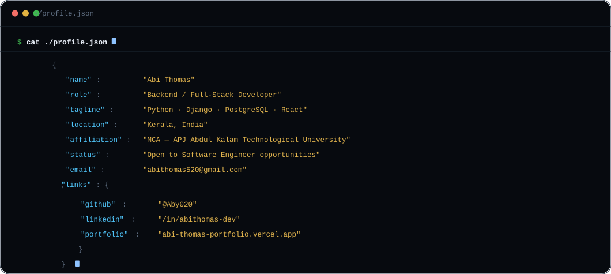
</picture>

## // about

<picture>
  <source media="(prefers-color-scheme:dark)" srcset="./assets/generated/sections/about--dark.svg">
  <source media="(prefers-color-scheme:light)" srcset="./assets/generated/sections/about--light.svg">
  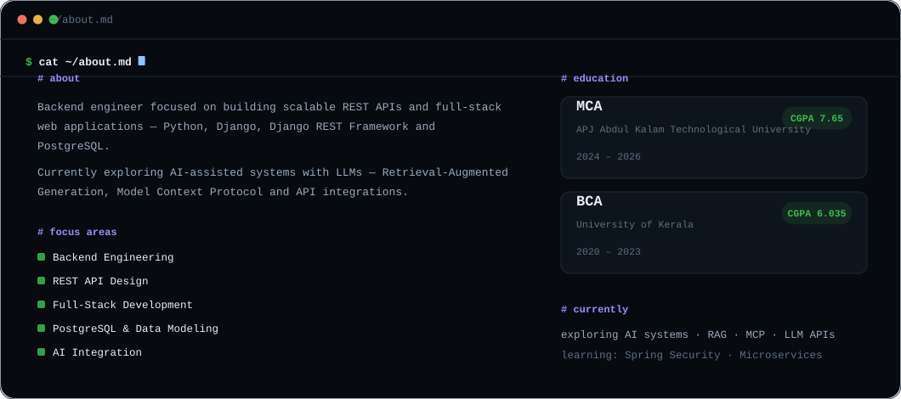
</picture>

## // tech.stack

<picture>
  <source media="(prefers-color-scheme:dark)" srcset="./assets/generated/sections/techStack--dark.svg">
  <source media="(prefers-color-scheme:light)" srcset="./assets/generated/sections/techStack--light.svg">
  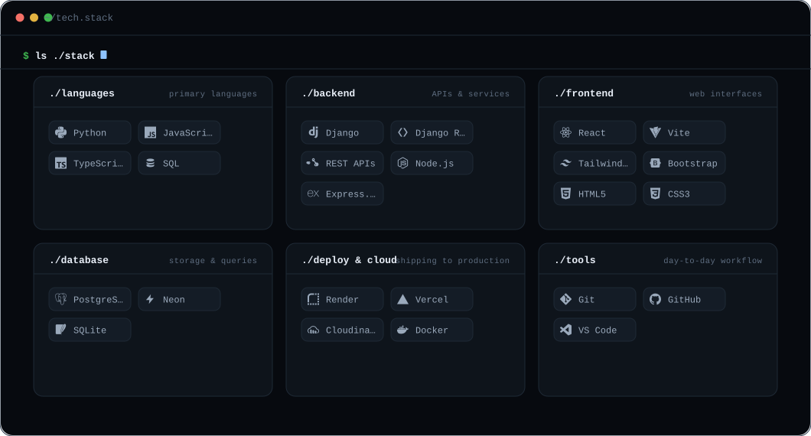
</picture>

## // repositories

<table style="width:100%;border-collapse:collapse">
<tr>
<td style="padding:16px 6px 10px 20px;vertical-align:middle;width:75%;">
<picture>
  <source media="(prefers-color-scheme:dark)" srcset="./assets/generated/cards/01--trustfund--dark.svg">
  <source media="(prefers-color-scheme:light)" srcset="./assets/generated/cards/01--trustfund--light.svg">
  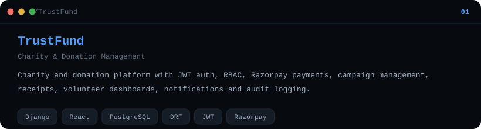
</picture>
</td>
<td style="width:25%;text-align:center;vertical-align:middle;padding:16px 20px 10px 6px;">
<a href="https://github.com/Aby020/TrustFund">
  <picture>
    <source media="(prefers-color-scheme:dark)" srcset="./assets/generated/buttons/repo--trustfund--dark.svg">
    <source media="(prefers-color-scheme:light)" srcset="./assets/generated/buttons/repo--trustfund--light.svg">
    
  </picture>
</a>

<a href="https://trustfund-i8r1.onrender.com/">
  <picture>
    <source media="(prefers-color-scheme:dark)" srcset="./assets/generated/buttons/demo--trustfund--dark.svg">
    <source media="(prefers-color-scheme:light)" srcset="./assets/generated/buttons/demo--trustfund--light.svg">
    
  </picture>
</a>
</td>
</tr>
<tr><td colspan="2" style="padding:0 20px;">

</td></tr>
<tr>
<td style="padding:16px 6px 10px 20px;vertical-align:middle;width:75%;">
<picture>
  <source media="(prefers-color-scheme:dark)" srcset="./assets/generated/cards/02--plannix--dark.svg">
  <source media="(prefers-color-scheme:light)" srcset="./assets/generated/cards/02--plannix--light.svg">
  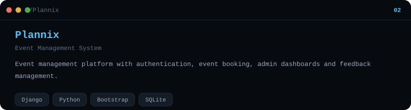
</picture>
</td>
<td style="width:25%;text-align:center;vertical-align:middle;padding:16px 20px 10px 6px;">
<a href="https://github.com/Aby020/Plannix">
  <picture>
    <source media="(prefers-color-scheme:dark)" srcset="./assets/generated/buttons/repo--plannix--dark.svg">
    <source media="(prefers-color-scheme:light)" srcset="./assets/generated/buttons/repo--plannix--light.svg">
    
  </picture>
</a>

<a href="https://plannix-0to5.onrender.com/">
  <picture>
    <source media="(prefers-color-scheme:dark)" srcset="./assets/generated/buttons/demo--plannix--dark.svg">
    <source media="(prefers-color-scheme:light)" srcset="./assets/generated/buttons/demo--plannix--light.svg">
    
  </picture>
</a>
</td>
</tr>
<tr><td colspan="2" style="padding:0 20px;">

</td></tr>
<tr>
<td style="padding:16px 6px 10px 20px;vertical-align:middle;width:75%;">
<picture>
  <source media="(prefers-color-scheme:dark)" srcset="./assets/generated/cards/03--resumeai--dark.svg">
  <source media="(prefers-color-scheme:light)" srcset="./assets/generated/cards/03--resumeai--light.svg">
  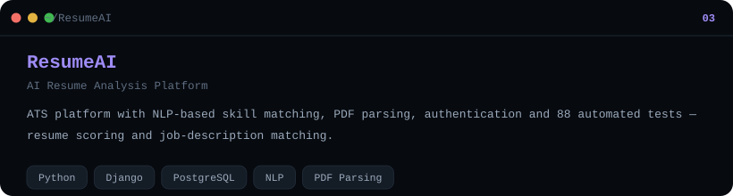
</picture>
</td>
<td style="width:25%;text-align:center;vertical-align:middle;padding:16px 20px 10px 6px;">
<a href="https://github.com/Aby020/ResumeAI">
  <picture>
    <source media="(prefers-color-scheme:dark)" srcset="./assets/generated/buttons/repo--resumeai--dark.svg">
    <source media="(prefers-color-scheme:light)" srcset="./assets/generated/buttons/repo--resumeai--light.svg">
    
  </picture>
</a>

<a href="https://resumeai-frontend-nguv.onrender.com/">
  <picture>
    <source media="(prefers-color-scheme:dark)" srcset="./assets/generated/buttons/demo--resumeai--dark.svg">
    <source media="(prefers-color-scheme:light)" srcset="./assets/generated/buttons/demo--resumeai--light.svg">
    
  </picture>
</a>
</td>
</tr>
<tr><td colspan="2" style="padding:0 20px;">

</td></tr>
<tr>
<td style="padding:16px 6px 10px 20px;vertical-align:middle;width:75%;">
<picture>
  <source media="(prefers-color-scheme:dark)" srcset="./assets/generated/cards/04--trackwise--dark.svg">
  <source media="(prefers-color-scheme:light)" srcset="./assets/generated/cards/04--trackwise--light.svg">
  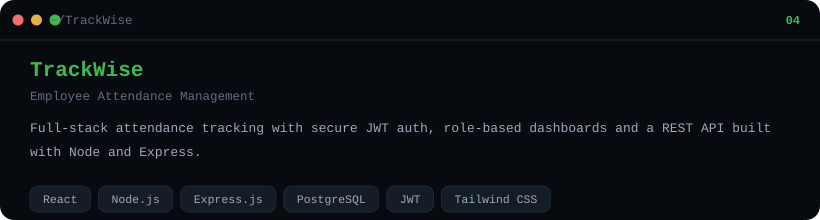
</picture>
</td>
<td style="width:25%;text-align:center;vertical-align:middle;padding:16px 20px 10px 6px;">
<a href="https://github.com/Aby020/TrackWise">
  <picture>
    <source media="(prefers-color-scheme:dark)" srcset="./assets/generated/buttons/repo--trackwise--dark.svg">
    <source media="(prefers-color-scheme:light)" srcset="./assets/generated/buttons/repo--trackwise--light.svg">
    
  </picture>
</a>

<a href="https://trackwise-frontend-tla4.onrender.com/">
  <picture>
    <source media="(prefers-color-scheme:dark)" srcset="./assets/generated/buttons/demo--trackwise--dark.svg">
    <source media="(prefers-color-scheme:light)" srcset="./assets/generated/buttons/demo--trackwise--light.svg">
    
  </picture>
</a>
</td>
</tr>
<tr><td colspan="2" style="padding:0 20px;">

</td></tr>
<tr>
<td style="padding:16px 6px 10px 20px;vertical-align:middle;width:75%;">
<picture>
  <source media="(prefers-color-scheme:dark)" srcset="./assets/generated/cards/05--servigo--dark.svg">
  <source media="(prefers-color-scheme:light)" srcset="./assets/generated/cards/05--servigo--light.svg">
  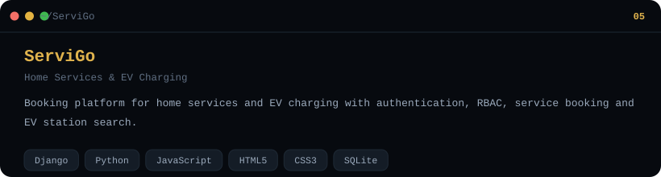
</picture>
</td>
<td style="width:25%;text-align:center;vertical-align:middle;padding:16px 20px 10px 6px;">
<a href="https://github.com/Aby020/ServiGo">
  <picture>
    <source media="(prefers-color-scheme:dark)" srcset="./assets/generated/buttons/repo--servigo--dark.svg">
    <source media="(prefers-color-scheme:light)" srcset="./assets/generated/buttons/repo--servigo--light.svg">
    
  </picture>
</a>
</td>
</tr>
</table>

## // roadmap

<picture>
  <source media="(prefers-color-scheme:dark)" srcset="./assets/generated/sections/roadmap--dark.svg">
  <source media="(prefers-color-scheme:light)" srcset="./assets/generated/sections/roadmap--light.svg">
  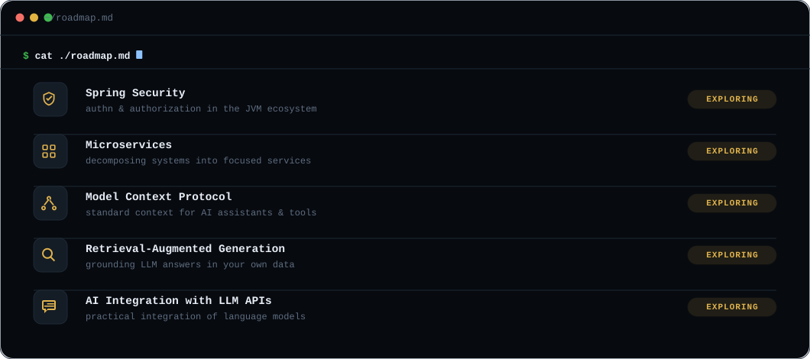
</picture>

## // activity

<table width="100%">
<tr>
<td width="70%" valign="top">

<picture>
  <source media="(prefers-color-scheme:dark)" srcset="https://raw.githubusercontent.com/Aby020/Aby020/output/github-contribution-grid-snake-dark.svg">
  <source media="(prefers-color-scheme:light)" srcset="https://raw.githubusercontent.com/Aby020/Aby020/output/github-contribution-grid-snake.svg">
  
</picture>

</td>
<td width="30%" valign="top" align="center">

<picture>
  <source media="(prefers-color-scheme:dark)" srcset="./assets/generated/sections/activity--dark.svg">
  <source media="(prefers-color-scheme:light)" srcset="./assets/generated/sections/activity--light.svg">
  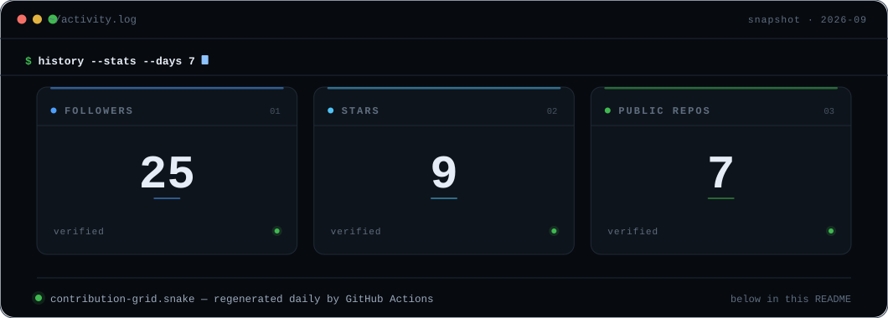
</picture>

</td>
</tr>
</table>

<picture>
  <source media="(prefers-color-scheme:dark)" srcset="./assets/generated/sections/signature--dark.svg">
  <source media="(prefers-color-scheme:light)" srcset="./assets/generated/sections/signature--light.svg">
  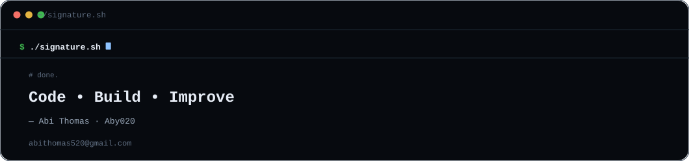
</picture>

