<!-- Generated by GitHub Profile Agent Console -->
      <style>.cta-button { background:#5c5fff; color:#fff; padding:8px 16px; display:inline-block; text-decoration:none; border-radius:4px; margin:10px; }</style>

<p align="center">
  <picture>
    <source media="(max-width:760px) and (prefers-color-scheme:dark)" srcset="./assets/hero/agent-console-a48c9cb6-mobile-dark.svg">
    <source media="(max-width:760px)" srcset="./assets/hero/agent-console-a48c9cb6-mobile-light.svg">
    <source media="(prefers-color-scheme:dark)" srcset="./assets/hero/agent-console-a48c9cb6-dark.svg">
    <source media="(prefers-color-scheme:light)" srcset="./assets/hero/agent-console-a48c9cb6-light.svg">
    
  </picture>
</p>

<p align="center">

  <a href="https://github.com/Aby020"></a>
  <a href="https://www.linkedin.com/in/abithomas-dev"></a>
  <a href="mailto:abithomas520@gmail.com"></a>

</p>

<hr>

## $ whoami

Backend Engineer focused on building scalable REST APIs and full-stack web applications with Python, Django, Django REST Framework, and PostgreSQL — and AI-powered systems with LLMs (RAG, MCP).

| | |
|--|--|
| `status` | Open to Software Engineer Opportunities |
| `education` | MCA — APJ Abdul Kalam Technological University |
| `location` | Kerala, India |
| `focus` | Python · Django · PostgreSQL · REST API Development |

<hr>

## $ cat focus.md

Currently focusing on building scalable backend systems and production-ready web applications.

<code>Python</code> <code>Django</code> <code>Django REST Framework</code> <code>REST API Development</code> <code>PostgreSQL</code> <code>Database Design</code> <code>Authentication & Authorization</code> <code>Full-Stack Development</code> <code>AI Integration</code> <code>System Design (Learning)</code> <code>Microservices (Learning)</code> <code>Clean Code & Best Practices</code>

<hr>

## $ ls projects/

<table width="100%"><tr>

<td width="50%" valign="top">

**📁 [ResumeAI](https://github.com/Aby020/ResumeAI)** · *AI Resume Analysis Platform*

> AI-powered resume analysis with ATS scoring, job-description matching, and intelligent feedback.

<p><code>Python</code> <code>Django</code> <code>PostgreSQL</code> <code>OCR</code> <code>PDF Parsing</code> <code>Bootstrap</code></p>

<p><small>✅ <code>Completed</code> · <a href="https://github.com/Aby020/ResumeAI">Repository</a></small></p>

</td>


<td width="50%" valign="top">

**📁 [TrackWise](https://github.com/Aby020/TrackWise)** · *Employee Attendance Management System*

> Full-stack attendance tracking with secure auth and role-based admin dashboards.

<p><code>React</code> <code>Node.js</code> <code>Express.js</code> <code>PostgreSQL</code> <code>JWT</code> <code>Tailwind CSS</code></p>

<p><small>✅ <code>Completed</code> · <a href="https://github.com/Aby020/TrackWise">Repository</a></small></p>

</td>

</tr>
<tr>

<td width="50%" valign="top">

**📁 [NEXVENT](https://github.com/Aby020/Nexvent)** · *Event Management Platform*

> Cloud-based event management for organizers and attendees.

<p><code>Django</code> <code>Python</code> <code>MySQL</code> <code>Bootstrap</code></p>

<p><small>✅ <code>Completed</code> · <a href="https://github.com/Aby020/Nexvent">Repository</a> · <a href="https://nexvent.pythonanywhere.com/">Live Demo</a></small></p>

</td>


<td width="50%" valign="top">

**📁 [NanoServ](https://github.com/Aby020/Nanoserv)** · *Home Service Booking*

> Location-based home service booking connecting customers and providers.

<p><code>Python</code> <code>HTML</code> <code>CSS</code> <code>JavaScript</code> <code>Google Maps API</code> <code>MySQL</code></p>

<p><small>✅ <code>Completed</code> · <a href="https://github.com/Aby020/Nanoserv">Repository</a> · <a href="https://nanoserv.pythonanywhere.com/">Live Demo</a></small></p>

</td>

</tr></table>

<hr>

## $ cat tech-stack.md

**Core stack** → <code>Python</code> <code>Django</code> <code>PostgreSQL</code> <code>REST API Development</code>

| Focus | Stack |
|-------|-------|
| **Backend** | <code>Python</code> <code>Django</code> <code>Django REST Framework</code> <code>Java</code> <code>Spring Boot</code> |
| **Frontend** | <code>HTML5</code> <code>CSS3</code> <code>JavaScript</code> <code>Bootstrap</code> |
| **Database** | <code>PostgreSQL</code> <code>MySQL</code> <code>MongoDB</code> |
| **DevOps & Deployment** | <code>Git</code> <code>GitHub Actions</code> <code>PythonAnywhere</code> <code>Render</code> <code>Cloudinary</code> |

<hr>

## $ tail -f learning.log

```text
$ tail -f learning.log
+ Spring Security
+ Microservices
+ Model Context Protocol (MCP)
+ Retrieval-Augmented Generation (RAG)
+ AI Integration with LLM APIs
```

<hr>

## $ gh stats


<div align="center">
  <picture>
  <source media="(prefers-color-scheme: dark)" srcset="https://github.com/Aby020/Aby020/blob/output/github-contribution-grid-snake-dark.svg">
  <source media="(prefers-color-scheme: light)" srcset="https://github.com/Aby020/Aby020/blob/output/github-contribution-grid-snake.svg">
  
</picture>
</div>


<hr>

<p align="center">

<code>⌘ Code • Build • Improve</code>

</p>
