<!-- Generated by GitHub Profile Agent Console -->

<p align="center">
  <picture>
    <source media="(max-width:760px) and (prefers-color-scheme:dark)" srcset="./assets/hero/agent-console-a5f49893-mobile-dark.svg">
    <source media="(max-width:760px)" srcset="./assets/hero/agent-console-a5f49893-mobile-light.svg">
    <source media="(prefers-color-scheme:dark)" srcset="./assets/hero/agent-console-a5f49893-dark.svg">
    <source media="(prefers-color-scheme:light)" srcset="./assets/hero/agent-console-a5f49893-light.svg">
    
  </picture>
</p>

<p align="center">

  <a href="https://github.com/Aby020"></a>
  <a href="https://www.linkedin.com/in/abithomas-dev"></a>
  <a href="mailto:abithomas520@gmail.com"></a>
  <a href="https://abi-thomas-portfolio.vercel.app/" target="_blank" rel="noopener noreferrer"></a>

</p>

<hr>


## // profile.json

$ cat profile.json

```json
{
  "name":     "Abi Thomas",
  "role":     "Software Engineer",
  "status":   "● Open to Software Engineer Opportunities",
  "location": "Kerala, India",
  "education": "MCA — APJ Abdul Kalam Technological University",
  "focus":    [
    "Python",
    "Django",
    "Django REST Framework",
    "REST API Development"
  ],
  "links": {
    "github":   "Aby020",
    "linkedin": "abithomas-dev",
    "email":    "abithomas520@..."
  },
  "portfolio": "https://abi-thomas-portfolio.vercel.app/"
}
```


<hr>


## // about

<blockquote>
Backend Engineer focused on building scalable REST APIs and full-stack web applications with Python, Django, Django REST Framework, and PostgreSQL — and AI-powered systems with LLMs (RAG, MCP).
</blockquote>


<hr>


## // tech.stack

**Core Stack** → <code><a href="https://github.com/topics/python" target="_blank" rel="noopener noreferrer"></a></code> <code><a href="https://github.com/topics/django" target="_blank" rel="noopener noreferrer"></a></code> <code><a href="https://github.com/topics/postgresql" target="_blank" rel="noopener noreferrer"></a></code> <code><a href="https://github.com/topics/rest%20api%20development" target="_blank" rel="noopener noreferrer"></a></code>

<table width="100%">
<tr><td valign="top"><strong>Backend</strong></td><td><code><a href="https://github.com/topics/python" target="_blank" rel="noopener noreferrer"></a></code> <code><a href="https://github.com/topics/django" target="_blank" rel="noopener noreferrer"></a></code> <code><a href="https://github.com/topics/django%20rest%20framework" target="_blank" rel="noopener noreferrer"></a></code> <code><a href="https://github.com/topics/java" target="_blank" rel="noopener noreferrer"></a></code> <code><a href="https://github.com/topics/spring%20boot" target="_blank" rel="noopener noreferrer"></a></code></td></tr>
<tr><td valign="top"><strong>Frontend</strong></td><td><code><a href="https://github.com/topics/html5" target="_blank" rel="noopener noreferrer"></a></code> <code><a href="https://github.com/topics/css3" target="_blank" rel="noopener noreferrer"></a></code> <code><a href="https://github.com/topics/javascript" target="_blank" rel="noopener noreferrer"></a></code> <code><a href="https://github.com/topics/bootstrap" target="_blank" rel="noopener noreferrer"></a></code></td></tr>
<tr><td valign="top"><strong>Database</strong></td><td><code><a href="https://github.com/topics/postgresql" target="_blank" rel="noopener noreferrer"></a></code> <code><a href="https://github.com/topics/mysql" target="_blank" rel="noopener noreferrer"></a></code> <code><a href="https://github.com/topics/mongodb" target="_blank" rel="noopener noreferrer"></a></code></td></tr>
<tr><td valign="top"><strong>DevOps & Deployment</strong></td><td><code><a href="https://github.com/topics/git" target="_blank" rel="noopener noreferrer"></a></code> <code><a href="https://github.com/topics/github%20actions" target="_blank" rel="noopener noreferrer"></a></code> <code><a href="https://github.com/topics/pythonanywhere" target="_blank" rel="noopener noreferrer"></a></code> <code><a href="https://github.com/topics/render" target="_blank" rel="noopener noreferrer"></a></code> <code><a href="https://github.com/topics/cloudinary" target="_blank" rel="noopener noreferrer"></a></code></td></tr>
</table>


<hr>


## // repositories

<table width="100%" style="border-collapse:collapse;width:100%;table-layout:fixed;"><tr>

<td width="50%" valign="top" style="padding:0 12px 24px 12px;vertical-align:top;min-width:280px;">

<div style="background:#0d1117;border:1px solid #30363d;border-radius:12px;padding:20px;min-height:160px;">


<div style="display:flex;align-items:center;justify-content:space-between;gap:8px;margin:0 0 8px 0;">
  <h3 style="margin:0;font-size:20px;font-weight:700;color:#f0f6fc;font-family:-apple-system,BlinkMacSystemFont,Segoe UI,Helvetica,Arial,sans-serif;letter-spacing:-0.02em;"><code style="background:#161b22;border:1px solid #ff7b72;border-radius:4px;padding:0 8px;font-size:18px;font-weight:700;color:#ff7b72;font-family:ui-monospace,SFMono-Regular,Menlo,Consolas,monospace;">ResumeAI</code></h3>
  <span style="display:inline-flex;align-items:center;gap:5px;font-size:12px;color:#3fb950;font-family:-apple-system,BlinkMacSystemFont,Segoe UI,Helvetica,Arial,sans-serif;white-space:nowrap;">● Completed</span>
</div>

<p style="margin:0 0 16px 0;font-size:14px;color:#8b949e;line-height:1.6;font-family:-apple-system,BlinkMacSystemFont,Segoe UI,Helvetica,Arial,sans-serif;">AI-powered resume analysis with ATS scoring, job-description matching, and intelligent feedback.</p>

<div style="margin:0 0 20px 0;"><code style="display:inline-block;background:#161b22;border:1px solid #30363d;border-radius:6px;padding:4px 10px;margin:3px 3px 0 0;font-size:12px;color:#c9d1d9;font-family:ui-monospace,SFMono-Regular,Menlo,Consolas,monospace;">Python</code><code style="display:inline-block;background:#161b22;border:1px solid #30363d;border-radius:6px;padding:4px 10px;margin:3px 3px 0 0;font-size:12px;color:#c9d1d9;font-family:ui-monospace,SFMono-Regular,Menlo,Consolas,monospace;">Django</code><code style="display:inline-block;background:#161b22;border:1px solid #30363d;border-radius:6px;padding:4px 10px;margin:3px 3px 0 0;font-size:12px;color:#c9d1d9;font-family:ui-monospace,SFMono-Regular,Menlo,Consolas,monospace;">PostgreSQL</code><code style="display:inline-block;background:#161b22;border:1px solid #30363d;border-radius:6px;padding:4px 10px;margin:3px 3px 0 0;font-size:12px;color:#c9d1d9;font-family:ui-monospace,SFMono-Regular,Menlo,Consolas,monospace;">OCR</code><code style="display:inline-block;background:#161b22;border:1px solid #30363d;border-radius:6px;padding:4px 10px;margin:3px 3px 0 0;font-size:12px;color:#c9d1d9;font-family:ui-monospace,SFMono-Regular,Menlo,Consolas,monospace;">PDF Parsing</code><code style="display:inline-block;background:#161b22;border:1px solid #30363d;border-radius:6px;padding:4px 10px;margin:3px 3px 0 0;font-size:12px;color:#c9d1d9;font-family:ui-monospace,SFMono-Regular,Menlo,Consolas,monospace;">Bootstrap</code></div>

<div style="text-align:center;"><a href="https://github.com/Aby020/ResumeAI" target="_blank" rel="noopener noreferrer" style="display:inline-block;font-size:14px;font-weight:600;color:#ffffff;text-decoration:none;font-family:-apple-system,BlinkMacSystemFont,Segoe UI,Helvetica,Arial,sans-serif;padding:12px 24px;background:#ff7b72;border-radius:8px;box-shadow:0 4px 14px color-mix(in srgb, #ff7b72 40%, transparent);border:2px solid #ff7b72;">View Repository →</a></div>

</div>

</td>


<td width="50%" valign="top" style="padding:0 12px 24px 12px;vertical-align:top;min-width:280px;">

<div style="background:#0d1117;border:1px solid #30363d;border-radius:12px;padding:20px;min-height:160px;">


<div style="display:flex;align-items:center;justify-content:space-between;gap:8px;margin:0 0 8px 0;">
  <h3 style="margin:0;font-size:20px;font-weight:700;color:#f0f6fc;font-family:-apple-system,BlinkMacSystemFont,Segoe UI,Helvetica,Arial,sans-serif;letter-spacing:-0.02em;"><code style="background:#161b22;border:1px solid #f0883e;border-radius:4px;padding:0 8px;font-size:18px;font-weight:700;color:#f0883e;font-family:ui-monospace,SFMono-Regular,Menlo,Consolas,monospace;">TrackWise</code></h3>
  <span style="display:inline-flex;align-items:center;gap:5px;font-size:12px;color:#3fb950;font-family:-apple-system,BlinkMacSystemFont,Segoe UI,Helvetica,Arial,sans-serif;white-space:nowrap;">● Completed</span>
</div>

<p style="margin:0 0 16px 0;font-size:14px;color:#8b949e;line-height:1.6;font-family:-apple-system,BlinkMacSystemFont,Segoe UI,Helvetica,Arial,sans-serif;">Full-stack attendance tracking with secure auth and role-based admin dashboards.</p>

<div style="margin:0 0 20px 0;"><code style="display:inline-block;background:#161b22;border:1px solid #30363d;border-radius:6px;padding:4px 10px;margin:3px 3px 0 0;font-size:12px;color:#c9d1d9;font-family:ui-monospace,SFMono-Regular,Menlo,Consolas,monospace;">React</code><code style="display:inline-block;background:#161b22;border:1px solid #30363d;border-radius:6px;padding:4px 10px;margin:3px 3px 0 0;font-size:12px;color:#c9d1d9;font-family:ui-monospace,SFMono-Regular,Menlo,Consolas,monospace;">Node.js</code><code style="display:inline-block;background:#161b22;border:1px solid #30363d;border-radius:6px;padding:4px 10px;margin:3px 3px 0 0;font-size:12px;color:#c9d1d9;font-family:ui-monospace,SFMono-Regular,Menlo,Consolas,monospace;">Express.js</code><code style="display:inline-block;background:#161b22;border:1px solid #30363d;border-radius:6px;padding:4px 10px;margin:3px 3px 0 0;font-size:12px;color:#c9d1d9;font-family:ui-monospace,SFMono-Regular,Menlo,Consolas,monospace;">PostgreSQL</code><code style="display:inline-block;background:#161b22;border:1px solid #30363d;border-radius:6px;padding:4px 10px;margin:3px 3px 0 0;font-size:12px;color:#c9d1d9;font-family:ui-monospace,SFMono-Regular,Menlo,Consolas,monospace;">JWT</code><code style="display:inline-block;background:#161b22;border:1px solid #30363d;border-radius:6px;padding:4px 10px;margin:3px 3px 0 0;font-size:12px;color:#c9d1d9;font-family:ui-monospace,SFMono-Regular,Menlo,Consolas,monospace;">Tailwind CSS</code></div>

<div style="text-align:center;"><a href="https://github.com/Aby020/TrackWise" target="_blank" rel="noopener noreferrer" style="display:inline-block;font-size:14px;font-weight:600;color:#ffffff;text-decoration:none;font-family:-apple-system,BlinkMacSystemFont,Segoe UI,Helvetica,Arial,sans-serif;padding:12px 24px;background:#f0883e;border-radius:8px;box-shadow:0 4px 14px color-mix(in srgb, #f0883e 40%, transparent);border:2px solid #f0883e;">View Repository →</a></div>

<div style="text-align:center;margin-top:12px;"><a href="https://trackwise-frontend-tla4.onrender.com" target="_blank" rel="noopener noreferrer" style="display:inline-block;font-size:14px;font-weight:600;color:#ffffff;text-decoration:none;font-family:-apple-system,BlinkMacSystemFont,Segoe UI,Helvetica,Arial,sans-serif;padding:12px 24px;background:#3fb950;border-radius:8px;box-shadow:0 4px 14px color-mix(in srgb, #3fb950 40%, transparent);border:2px solid #3fb950;">Live Demo →</a></div>

</div>

</td>

</tr>
<tr>

<td width="50%" valign="top" style="padding:0 12px 24px 12px;vertical-align:top;min-width:280px;">

<div style="background:#0d1117;border:1px solid #30363d;border-radius:12px;padding:20px;min-height:160px;">


<div style="display:flex;align-items:center;justify-content:space-between;gap:8px;margin:0 0 8px 0;">
  <h3 style="margin:0;font-size:20px;font-weight:700;color:#f0f6fc;font-family:-apple-system,BlinkMacSystemFont,Segoe UI,Helvetica,Arial,sans-serif;letter-spacing:-0.02em;"><code style="background:#161b22;border:1px solid #79c0ff;border-radius:4px;padding:0 8px;font-size:18px;font-weight:700;color:#79c0ff;font-family:ui-monospace,SFMono-Regular,Menlo,Consolas,monospace;">Plannix</code></h3>
  <span style="display:inline-flex;align-items:center;gap:5px;font-size:12px;color:#3fb950;font-family:-apple-system,BlinkMacSystemFont,Segoe UI,Helvetica,Arial,sans-serif;white-space:nowrap;">● Completed</span>
</div>

<p style="margin:0 0 16px 0;font-size:14px;color:#8b949e;line-height:1.6;font-family:-apple-system,BlinkMacSystemFont,Segoe UI,Helvetica,Arial,sans-serif;">Cloud-based event management for organizers and attendees.</p>

<div style="margin:0 0 20px 0;"><code style="display:inline-block;background:#161b22;border:1px solid #30363d;border-radius:6px;padding:4px 10px;margin:3px 3px 0 0;font-size:12px;color:#c9d1d9;font-family:ui-monospace,SFMono-Regular,Menlo,Consolas,monospace;">Django</code><code style="display:inline-block;background:#161b22;border:1px solid #30363d;border-radius:6px;padding:4px 10px;margin:3px 3px 0 0;font-size:12px;color:#c9d1d9;font-family:ui-monospace,SFMono-Regular,Menlo,Consolas,monospace;">Python</code><code style="display:inline-block;background:#161b22;border:1px solid #30363d;border-radius:6px;padding:4px 10px;margin:3px 3px 0 0;font-size:12px;color:#c9d1d9;font-family:ui-monospace,SFMono-Regular,Menlo,Consolas,monospace;">MySQL</code><code style="display:inline-block;background:#161b22;border:1px solid #30363d;border-radius:6px;padding:4px 10px;margin:3px 3px 0 0;font-size:12px;color:#c9d1d9;font-family:ui-monospace,SFMono-Regular,Menlo,Consolas,monospace;">Bootstrap</code></div>

<div style="text-align:center;"><a href="https://github.com/Aby020/Nexvent" target="_blank" rel="noopener noreferrer" style="display:inline-block;font-size:14px;font-weight:600;color:#ffffff;text-decoration:none;font-family:-apple-system,BlinkMacSystemFont,Segoe UI,Helvetica,Arial,sans-serif;padding:12px 24px;background:#79c0ff;border-radius:8px;box-shadow:0 4px 14px color-mix(in srgb, #79c0ff 40%, transparent);border:2px solid #79c0ff;">View Repository →</a></div>

</div>

</td>


<td width="50%" valign="top" style="padding:0 12px 24px 12px;vertical-align:top;min-width:280px;">

<div style="background:#0d1117;border:1px solid #30363d;border-radius:12px;padding:20px;min-height:160px;">


<div style="display:flex;align-items:center;justify-content:space-between;gap:8px;margin:0 0 8px 0;">
  <h3 style="margin:0;font-size:20px;font-weight:700;color:#f0f6fc;font-family:-apple-system,BlinkMacSystemFont,Segoe UI,Helvetica,Arial,sans-serif;letter-spacing:-0.02em;"><code style="background:#161b22;border:1px solid #a371f7;border-radius:4px;padding:0 8px;font-size:18px;font-weight:700;color:#a371f7;font-family:ui-monospace,SFMono-Regular,Menlo,Consolas,monospace;">ServiGo</code></h3>
  <span style="display:inline-flex;align-items:center;gap:5px;font-size:12px;color:#3fb950;font-family:-apple-system,BlinkMacSystemFont,Segoe UI,Helvetica,Arial,sans-serif;white-space:nowrap;">● Completed</span>
</div>

<p style="margin:0 0 16px 0;font-size:14px;color:#8b949e;line-height:1.6;font-family:-apple-system,BlinkMacSystemFont,Segoe UI,Helvetica,Arial,sans-serif;">Location-based home service booking connecting customers and providers.</p>

<div style="margin:0 0 20px 0;"><code style="display:inline-block;background:#161b22;border:1px solid #30363d;border-radius:6px;padding:4px 10px;margin:3px 3px 0 0;font-size:12px;color:#c9d1d9;font-family:ui-monospace,SFMono-Regular,Menlo,Consolas,monospace;">Python</code><code style="display:inline-block;background:#161b22;border:1px solid #30363d;border-radius:6px;padding:4px 10px;margin:3px 3px 0 0;font-size:12px;color:#c9d1d9;font-family:ui-monospace,SFMono-Regular,Menlo,Consolas,monospace;">HTML</code><code style="display:inline-block;background:#161b22;border:1px solid #30363d;border-radius:6px;padding:4px 10px;margin:3px 3px 0 0;font-size:12px;color:#c9d1d9;font-family:ui-monospace,SFMono-Regular,Menlo,Consolas,monospace;">CSS</code><code style="display:inline-block;background:#161b22;border:1px solid #30363d;border-radius:6px;padding:4px 10px;margin:3px 3px 0 0;font-size:12px;color:#c9d1d9;font-family:ui-monospace,SFMono-Regular,Menlo,Consolas,monospace;">JavaScript</code><code style="display:inline-block;background:#161b22;border:1px solid #30363d;border-radius:6px;padding:4px 10px;margin:3px 3px 0 0;font-size:12px;color:#c9d1d9;font-family:ui-monospace,SFMono-Regular,Menlo,Consolas,monospace;">Google Maps API</code><code style="display:inline-block;background:#161b22;border:1px solid #30363d;border-radius:6px;padding:4px 10px;margin:3px 3px 0 0;font-size:12px;color:#c9d1d9;font-family:ui-monospace,SFMono-Regular,Menlo,Consolas,monospace;">MySQL</code></div>

<div style="text-align:center;"><a href="https://github.com/Aby020/Nanoserv" target="_blank" rel="noopener noreferrer" style="display:inline-block;font-size:14px;font-weight:600;color:#ffffff;text-decoration:none;font-family:-apple-system,BlinkMacSystemFont,Segoe UI,Helvetica,Arial,sans-serif;padding:12px 24px;background:#a371f7;border-radius:8px;box-shadow:0 4px 14px color-mix(in srgb, #a371f7 40%, transparent);border:2px solid #a371f7;">View Repository →</a></div>

</div>

</td>

</tr></table>


<hr>


## // roadmap

**Currently Exploring** → <code><a href="https://github.com/topics/spring-security" target="_blank" rel="noopener noreferrer"></a></code> <code><a href="https://github.com/topics/microservices" target="_blank" rel="noopener noreferrer"></a></code> <code><a href="https://github.com/topics/model-context-protocol-(mcp)" target="_blank" rel="noopener noreferrer"></a></code> <code><a href="https://github.com/topics/retrieval-augmented-generation-(rag)" target="_blank" rel="noopener noreferrer"></a></code> <code><a href="https://github.com/topics/ai-integration-with-llm-apis" target="_blank" rel="noopener noreferrer"></a></code>


<hr>


## // activity


<table width="100%">
<tr>
<td width="70%" valign="top">

<picture>
  <source media="(prefers-color-scheme: dark)" srcset="https://github.com/Aby020/Aby020/blob/output/github-contribution-grid-snake-dark.svg">
  <source media="(prefers-color-scheme: light)" srcset="https://github.com/Aby020/Aby020/blob/output/github-contribution-grid-snake.svg">
  
</picture>

</td>
<td width="30%" valign="top" align="center">

<strong>Activity Stats</strong>


</td>
</tr>
</table>


<hr>

<p align="center">

<code>Code • Build • Improve</code>

</p>
