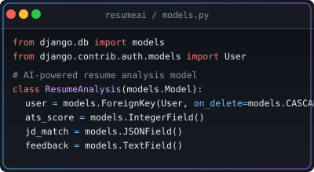
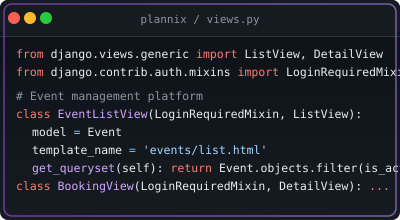
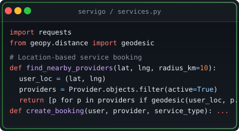

<!-- Generated by GitHub Profile Agent Console -->

<p align="center">
  <picture>
    <source media="(max-width:760px) and (prefers-color-scheme:dark)" srcset="./assets/hero/agent-console-a48c9cb6-mobile-dark.svg">
    <source media="(max-width:760px)" srcset="./assets/hero/agent-console-a48c9cb6-mobile-light.svg">
    <source media="(prefers-color-scheme:dark)" srcset="./assets/hero/agent-console-a48c9cb6-dark.svg">
    <source media="(prefers-color-scheme:light)" srcset="./assets/hero/agent-console-a48c9cb6-light.svg">
    
  </picture>
</p>

<p align="center">

  <a href="https://github.com/Aby020"></a>
  <a href="https://www.linkedin.com/in/abithomas-dev"></a>
  <a href="mailto:abithomas520@gmail.com"></a>

</p>

<hr>


## // profile.json

$ cat profile.json

```json
{
  "name":     "Abi Thomas",
  "role":     "Software Engineer",
  "status":   "● Open to Software Engineer Opportunities",
  "location": "Kerala, India",
  "education": "MCA — APJ Abdul Kalam Technological University",
  "focus":    [
    "Python",
    "Django",
    "Django REST Framework",
    "REST API Development"
  ],
  "links": {
    "github":   "Aby020",
    "linkedin": "abithomas-dev",
    "email":    "abithomas520@..."
  },
  "portfolio": "https://abi-thomas-portfolio.vercel.app/"
}
```


<hr>


## // about

<blockquote>
Backend Engineer focused on building scalable REST APIs and full-stack web applications with Python, Django, Django REST Framework, and PostgreSQL — and AI-powered systems with LLMs (RAG, MCP).
</blockquote>


<hr>


## // tech.stack

**Core Stack** → <code><a href="https://github.com/topics/python" target="_blank" rel="noopener noreferrer"></a></code> <code><a href="https://github.com/topics/django" target="_blank" rel="noopener noreferrer"></a></code> <code><a href="https://github.com/topics/postgresql" target="_blank" rel="noopener noreferrer"></a></code> <code><a href="https://github.com/topics/rest%20api%20development" target="_blank" rel="noopener noreferrer"></a></code>

<table width="100%">
<tr><td valign="top"><strong>Backend</strong></td><td><code><a href="https://github.com/topics/python" target="_blank" rel="noopener noreferrer"></a></code> <code><a href="https://github.com/topics/django" target="_blank" rel="noopener noreferrer"></a></code> <code><a href="https://github.com/topics/django%20rest%20framework" target="_blank" rel="noopener noreferrer"></a></code> <code><a href="https://github.com/topics/java" target="_blank" rel="noopener noreferrer"></a></code> <code><a href="https://github.com/topics/spring%20boot" target="_blank" rel="noopener noreferrer"></a></code></td></tr>
<tr><td valign="top"><strong>Frontend</strong></td><td><code><a href="https://github.com/topics/html5" target="_blank" rel="noopener noreferrer"></a></code> <code><a href="https://github.com/topics/css3" target="_blank" rel="noopener noreferrer"></a></code> <code><a href="https://github.com/topics/javascript" target="_blank" rel="noopener noreferrer"></a></code> <code><a href="https://github.com/topics/bootstrap" target="_blank" rel="noopener noreferrer"></a></code></td></tr>
<tr><td valign="top"><strong>Database</strong></td><td><code><a href="https://github.com/topics/postgresql" target="_blank" rel="noopener noreferrer"></a></code> <code><a href="https://github.com/topics/mysql" target="_blank" rel="noopener noreferrer"></a></code> <code><a href="https://github.com/topics/mongodb" target="_blank" rel="noopener noreferrer"></a></code></td></tr>
<tr><td valign="top"><strong>DevOps & Deployment</strong></td><td><code><a href="https://github.com/topics/git" target="_blank" rel="noopener noreferrer"></a></code> <code><a href="https://github.com/topics/github%20actions" target="_blank" rel="noopener noreferrer"></a></code> <code><a href="https://github.com/topics/pythonanywhere" target="_blank" rel="noopener noreferrer"></a></code> <code><a href="https://github.com/topics/render" target="_blank" rel="noopener noreferrer"></a></code> <code><a href="https://github.com/topics/cloudinary" target="_blank" rel="noopener noreferrer"></a></code></td></tr>
</table>


<hr>


## // repositories

<table width="100%"><tr>

<td width="50%" valign="top" align="center">



**���� [ResumeAI](https://github.com/Aby020/ResumeAI)** 

*AI Resume Analysis Platform*

> AI-powered resume analysis with ATS scoring, job-description matching, and intelligent feedback.

<div>
<code>Python</code> <code>Django</code> <code>PostgreSQL</code> <code>OCR</code> <code>PDF Parsing</code> <code>Bootstrap</code>
</div>

<p><small><a href="https://github.com/Aby020/ResumeAI" target="_blank" rel="noopener noreferrer">Repository</a></small></p>

</td>


<td width="50%" valign="top" align="center">


**���� [TrackWise](https://github.com/Aby020/TrackWise)** 

*Employee Attendance Management System*

> Full-stack attendance tracking with secure auth and role-based admin dashboards.

<div>
<code>React</code> <code>Node.js</code> <code>Express.js</code> <code>PostgreSQL</code> <code>JWT</code> <code>Tailwind CSS</code>
</div>

<p><small><a href="https://github.com/Aby020/TrackWise" target="_blank" rel="noopener noreferrer">Repository</a></small></p>

</td>

</tr>
<tr>

<td width="50%" valign="top" align="center">



**���� [Plannix](https://github.com/Aby020/Nexvent)** 

*Event Management Platform*

> Cloud-based event management for organizers and attendees.

<div>
<code>Django</code> <code>Python</code> <code>MySQL</code> <code>Bootstrap</code>
</div>

<p><small><a href="https://github.com/Aby020/Nexvent" target="_blank" rel="noopener noreferrer">Repository</a> · <a href="https://nexvent.pythonanywhere.com/" target="_blank" rel="noopener noreferrer">Live Demo</a></small></p>

</td>


<td width="50%" valign="top" align="center">



**���� [ServiGo](https://github.com/Aby020/Nanoserv)** 

*Home Service Booking*

> Location-based home service booking connecting customers and providers.

<div>
<code>Python</code> <code>HTML</code> <code>CSS</code> <code>JavaScript</code> <code>Google Maps API</code> <code>MySQL</code>
</div>

<p><small><a href="https://github.com/Aby020/Nanoserv" target="_blank" rel="noopener noreferrer">Repository</a> · <a href="https://nanoserv.pythonanywhere.com/" target="_blank" rel="noopener noreferrer">Live Demo</a></small></p>

</td>

</tr></table>


<hr>


## // timeline

<table width="100%">
<tr>
  <td valign="top" width="60"><code>2026</code></td>
  <td valign="top" width="30"><code style="color: a855f7;">├─</code></td>
  <td valign="top">
    <strong>���� MCA — APJ Abdul Kalam Technological University</strong><br>
    <code>CGPA 7.65 · Backend Development Focus</code>
  </td>
</tr>
<tr>
  <td valign="top" width="60"><code>2026</code></td>
  <td valign="top" width="30"><code style="color: 58a6ff;">├─</code></td>
  <td valign="top">
    <strong>���� ResumeAI — AI Resume Analysis Platform</strong><br>
    <code>Django · PostgreSQL · OCR · RAG</code>
  </td>
</tr>
<tr>
  <td valign="top" width="60"><code>2026</code></td>
  <td valign="top" width="30"><code style="color: 22d3ee;">├─</code></td>
  <td valign="top">
    <strong>���� TrackWise — Employee Attendance System</strong><br>
    <code>React · Node.js · PostgreSQL · JWT</code>
  </td>
</tr>
<tr>
  <td valign="top" width="60"><code>2026</code></td>
  <td valign="top" width="30"><code style="color: a855f7;">��─</code></td>
  <td valign="top">
    <strong>���� Plannix — Event Management Platform</strong><br>
    <code>Django · MySQL · Bootstrap</code>
  </td>
</tr>
<tr>
  <td valign="top" width="60"><code>2025</code></td>
  <td valign="top" width="30"><code style="color: 3fb950;">��─</code></td>
  <td valign="top">
    <strong>���� ServiGo — Home Service Booking</strong><br>
    <code>Python · JavaScript · Google Maps API · MySQL</code>
  </td>
</tr>
<tr>
  <td valign="top" width="60"><code>2023</code></td>
  <td valign="top" width="30"><code style="color: a855f7;">��─</code></td>
  <td valign="top">
    <strong>���� BCA — University of Kerala</strong><br>
    <code>CGPA 6.035</code>
  </td>
</tr>
</table>


<hr>


## // roadmap

**Currently Exploring** → <code><a href="https://github.com/topics/spring-security" target="_blank" rel="noopener noreferrer"></a></code> <code><a href="https://github.com/topics/microservices" target="_blank" rel="noopener noreferrer"></a></code> <code><a href="https://github.com/topics/model-context-protocol-(mcp)" target="_blank" rel="noopener noreferrer"></a></code> <code><a href="https://github.com/topics/retrieval-augmented-generation-(rag)" target="_blank" rel="noopener noreferrer"></a></code> <code><a href="https://github.com/topics/ai-integration-with-llm-apis" target="_blank" rel="noopener noreferrer"></a></code>


<hr>


## // activity


<table width="100%">
<tr>
<td width="70%" valign="top">

<picture>
  <source media="(prefers-color-scheme: dark)" srcset="https://github.com/Aby020/Aby020/blob/output/github-contribution-grid-snake-dark.svg">
  <source media="(prefers-color-scheme: light)" srcset="https://github.com/Aby020/Aby020/blob/output/github-contribution-grid-snake.svg">
  
</picture>

</td>
<td width="30%" valign="top" align="center">

<strong>Activity Stats</strong>


</td>
</tr>
</table>


<hr>

<p align="center">

**���� [https://abi-thomas-portfolio.vercel.app/](https://abi-thomas-portfolio.vercel.app/)**

</p>

<p align="center">

<code>Code • Build • Improve</code>

</p>
