<!-- Generated by GitHub Profile Agent Console -->

<p align="center">
  <picture>
    <source media="(max-width:760px) and (prefers-color-scheme:dark)" srcset="./assets/hero/agent-console-a5f49893-mobile-dark.svg">
    <source media="(max-width:760px)" srcset="./assets/hero/agent-console-a5f49893-mobile-light.svg">
    <source media="(prefers-color-scheme:dark)" srcset="./assets/hero/agent-console-a5f49893-dark.svg">
    <source media="(prefers-color-scheme:light)" srcset="./assets/hero/agent-console-a5f49893-light.svg">
    
  </picture>
</p>

<p align="center">

  <a href="https://github.com/Aby020"></a>
  <a href="https://www.linkedin.com/in/abithomas-dev"></a>
  <a href="mailto:abithomas520@gmail.com"></a>
  <a href="https://abi-thomas-portfolio.vercel.app/" target="_blank" rel="noopener noreferrer"></a>

</p>

<hr>


## // profile.json

$ cat profile.json

```json
{
  "name":     "Abi Thomas",
  "role":     "Backend / Full-Stack Developer",
  "status":   "★ Open to Software Engineer Opportunities",
  "location": "Kerala, India",
  "education": "MCA — APJ Abdul Kalam Technological University",
  "focus":    [
    "Python",
    "Django",
    "Django REST Framework",
    "REST API Development",
    "React",
    "TypeScript",
    "Node.js",
    "PostgreSQL"
  ],
  "links": {
    "github":   "Aby020",
    "linkedin": "abithomas-dev",
    "email":    "abithomas520@gmail.com"
  },
  "portfolio": "https://abi-thomas-portfolio.vercel.app/"
}
```


<hr>


## // about

<blockquote>
Backend and full-stack developer based in Kerala, India, focused on building database-driven applications with Python, Django, Django REST Framework, React, TypeScript, and PostgreSQL — from authentication and role-based access to API integration, testing, and deployment.
</blockquote>


<hr>


## // tech.stack

**Core Stack** → <code><a href="https://github.com/topics/python" target="_blank" rel="noopener noreferrer"></a></code> <code><a href="https://github.com/topics/django" target="_blank" rel="noopener noreferrer"></a></code> <code><a href="https://github.com/topics/django%20rest%20framework" target="_blank" rel="noopener noreferrer"></a></code> <code><a href="https://github.com/topics/postgresql" target="_blank" rel="noopener noreferrer"></a></code> <code><a href="https://github.com/topics/react" target="_blank" rel="noopener noreferrer"></a></code> <code><a href="https://github.com/topics/typescript" target="_blank" rel="noopener noreferrer"></a></code>

<table width="100%">
<tr><td valign="top"><strong>Languages</strong></td><td><code><a href="https://github.com/topics/python" target="_blank" rel="noopener noreferrer"></a></code> <code><a href="https://github.com/topics/javascript" target="_blank" rel="noopener noreferrer"></a></code> <code><a href="https://github.com/topics/typescript" target="_blank" rel="noopener noreferrer"></a></code> <code><a href="https://github.com/topics/sql" target="_blank" rel="noopener noreferrer"></a></code></td></tr>
<tr><td valign="top"><strong>Backend</strong></td><td><code><a href="https://github.com/topics/python" target="_blank" rel="noopener noreferrer"></a></code> <code><a href="https://github.com/topics/django" target="_blank" rel="noopener noreferrer"></a></code> <code><a href="https://github.com/topics/django%20rest%20framework" target="_blank" rel="noopener noreferrer"></a></code> <code><a href="https://github.com/topics/rest%20api%20development" target="_blank" rel="noopener noreferrer"></a></code> <code><a href="https://github.com/topics/nodejs" target="_blank" rel="noopener noreferrer"></a></code> <code><a href="https://github.com/topics/express" target="_blank" rel="noopener noreferrer"></a></code></td></tr>
<tr><td valign="top"><strong>Frontend</strong></td><td><code><a href="https://github.com/topics/react" target="_blank" rel="noopener noreferrer"></a></code> <code><a href="https://github.com/topics/vite" target="_blank" rel="noopener noreferrer"></a></code> <code><a href="https://github.com/topics/tailwindcss" target="_blank" rel="noopener noreferrer"></a></code> <code><a href="https://github.com/topics/bootstrap" target="_blank" rel="noopener noreferrer"></a></code> <code><a href="https://github.com/topics/html5" target="_blank" rel="noopener noreferrer"></a></code> <code><a href="https://github.com/topics/css3" target="_blank" rel="noopener noreferrer"></a></code></td></tr>
<tr><td valign="top"><strong>Database</strong></td><td><code><a href="https://github.com/topics/postgresql" target="_blank" rel="noopener noreferrer"></a></code> <code><a href="https://github.com/topics/postgresql" target="_blank" rel="noopener noreferrer"></a></code> <code><a href="https://github.com/topics/sqlite" target="_blank" rel="noopener noreferrer"></a></code></td></tr>
<tr><td valign="top"><strong>Deployment & Cloud</strong></td><td><code><a href="https://github.com/topics/render" target="_blank" rel="noopener noreferrer"></a></code> <code><a href="https://github.com/topics/vercel" target="_blank" rel="noopener noreferrer"></a></code> <code><a href="https://github.com/topics/cloudinary" target="_blank" rel="noopener noreferrer"></a></code> <code><a href="https://github.com/topics/docker" target="_blank" rel="noopener noreferrer"></a></code></td></tr>
<tr><td valign="top"><strong>Tools</strong></td><td><code><a href="https://github.com/topics/git" target="_blank" rel="noopener noreferrer"></a></code> <code><a href="https://github.com/topics/github" target="_blank" rel="noopener noreferrer"></a></code> <code><a href="https://github.com/topics/docker" target="_blank" rel="noopener noreferrer"></a></code> <code><a href="https://github.com/topics/visual-studio-code" target="_blank" rel="noopener noreferrer"></a></code></td></tr>
</table>


<hr>


## // repositories

<div style="background:#0d1117;border:1px solid #30363d;border-radius:12px;">
<table style="width:100%;border-collapse:collapse">
<tr>
<td style="background:#161b22;padding:0 20px;height:48px;border-bottom:1px solid #30363d;border-radius:9px 0 0 0;">
<span style="color:#ff5f57;font-size:16px;">●</span><span style="color:#febc2e;font-size:16px;margin-left:7px;">●</span><span style="color:#28c840;font-size:16px;margin-left:7px;">●</span><span style="color:#8b949e;font-size:13px;margin-left:16px;font-family:ui-monospace,SFMono-Regular,Menlo,Consolas,monospace;">// repositories</span>
</td>
<td style="background:#161b22;padding:0 20px;height:48px;border-bottom:1px solid #30363d;text-align:right;border-radius:0 9px 0 0;width:140px;">
<span style="color:#484f58;font-size:12px;font-family:ui-monospace,SFMono-Regular,Menlo,Consolas,monospace;">05 projects</span>
</td>
</tr>
<tr>
<td colspan="2" style="padding:10px 20px;border-bottom:1px solid #21262d;">
<span style="color:#79c0ff;font-size:14px;font-family:ui-monospace,SFMono-Regular,Menlo,Consolas,monospace;">$</span><span style="color:#c9d1d9;font-size:14px;font-family:ui-monospace,SFMono-Regular,Menlo,Consolas,monospace;"> ls -1 ./projects</span>
</td>
</tr>
<tr>
<td style="padding:16px 6px 10px 20px;vertical-align:middle;width:75%;">

</td>
<td style="width:25%;text-align:center;vertical-align:middle;padding:16px 20px 10px 6px;">
<a href="https://github.com/Aby020/TrustFund"></a>
<div style="height:8px;"></div>
<a href="https://trustfund-i8r1.onrender.com/"></a>
</td>
</tr>
<tr><td colspan="2" style="padding:0 20px;"><div style="height:1px;background:#21262d;"></div></td></tr>
<tr>
<td style="padding:14px 6px 10px 20px;vertical-align:middle;width:75%;">

</td>
<td style="width:25%;text-align:center;vertical-align:middle;padding:14px 20px 10px 6px;">
<a href="https://github.com/Aby020/Plannix"></a>
<div style="height:8px;"></div>
<a href="https://plannix-0to5.onrender.com/"></a>
</td>
</tr>
<tr><td colspan="2" style="padding:0 20px;"><div style="height:1px;background:#21262d;"></div></td></tr>
<tr>
<td style="padding:14px 6px 10px 20px;vertical-align:middle;width:75%;">

</td>
<td style="width:25%;text-align:center;vertical-align:middle;padding:14px 20px 10px 6px;">
<a href="https://github.com/Aby020/ResumeAI"></a>
<div style="height:8px;"></div>
<a href="https://resumeai-backend-8rza.onrender.com/"></a>
</td>
</tr>
<tr><td colspan="2" style="padding:0 20px;"><div style="height:1px;background:#21262d;"></div></td></tr>
<tr>
<td style="padding:14px 6px 10px 20px;vertical-align:middle;width:75%;">

</td>
<td style="width:25%;text-align:center;vertical-align:middle;padding:14px 20px 10px 6px;">
<a href="https://github.com/Aby020/TrackWise"></a>
<div style="height:8px;"></div>
<a href="https://trackwise-frontend-tla4.onrender.com/"></a>
</td>
</tr>
<tr><td colspan="2" style="padding:0 20px;"><div style="height:1px;background:#21262d;"></div></td></tr>
<tr>
<td style="padding:14px 6px 10px 20px;vertical-align:middle;width:75%;">

</td>
<td style="width:25%;text-align:center;vertical-align:middle;padding:14px 20px 10px 6px;">
<a href="https://github.com/Aby020/ServiGo"></a>
</td>
</tr>
<tr>
<td style="padding:10px 20px;border-top:1px solid #30363d;">
<span style="color:#30363d;font-size:12px;font-family:ui-monospace,SFMono-Regular,Menlo,Consolas,monospace;">05 projects listed</span>
</td>
<td style="padding:10px 20px;border-top:1px solid #30363d;text-align:right;">
<span style="color:#3fb950;font-size:12px;font-family:ui-monospace,SFMono-Regular,Menlo,Consolas,monospace;">● complete</span>
</td>
</tr>
</table>
</div>


<hr>


## // roadmap

**Currently Exploring** → <code><a href="https://github.com/topics/spring-security" target="_blank" rel="noopener noreferrer"></a></code> <code><a href="https://github.com/topics/microservices" target="_blank" rel="noopener noreferrer"></a></code> <code><a href="https://github.com/topics/model-context-protocol" target="_blank" rel="noopener noreferrer"></a></code> <code><a href="https://github.com/topics/retrieval-augmented-generation" target="_blank" rel="noopener noreferrer"></a></code> <code><a href="https://github.com/topics/ai-integration-with-llm-apis" target="_blank" rel="noopener noreferrer"></a></code>


<hr>


## // activity


<table width="100%">
<tr>
<td width="70%" valign="top">

<picture>
  <source media="(prefers-color-scheme: dark)" srcset="https://raw.githubusercontent.com/Aby020/Aby020/output/github-contribution-grid-snake-dark.svg">
  <source media="(prefers-color-scheme: light)" srcset="https://raw.githubusercontent.com/Aby020/Aby020/output/github-contribution-grid-snake.svg">
  
</picture>

</td>
<td width="30%" valign="top" align="center">

<strong>Activity Stats</strong>


</td>
</tr>
</table>


<hr>

<p align="center">

<code>Code • Build • Improve</code>

</p>
````